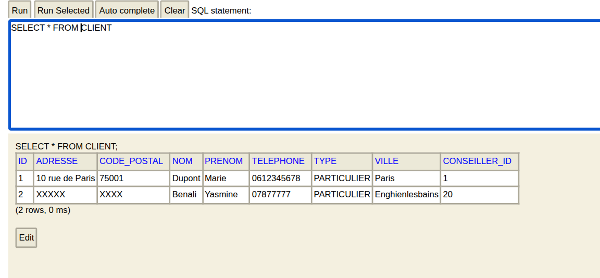
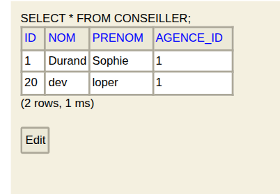
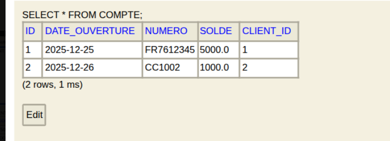
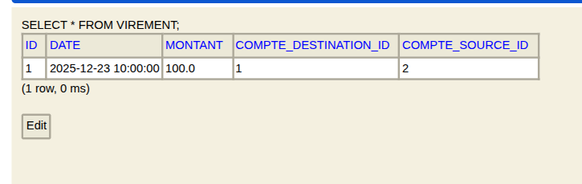
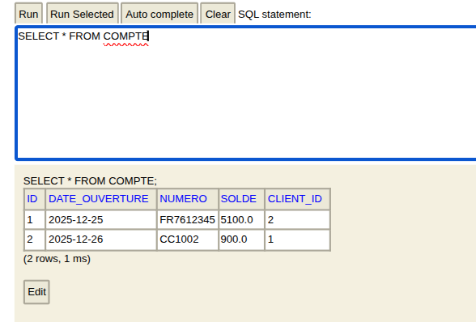

# ProxiBanqueSI : Fonctionnalités

## 1. Fonctionnalités implementées :

- Gestion des clients (création, modification, suppression, consultation)
- Gestion des comptes (création de comptes courants et épargne)
- Gestion des conseillers et gérants
- Gestion des agences bancaires
- Virements entre comptes
- Simulation de crédit consommation
- Gestion des clients fortunés (solde > 500 000 €)
- Audit des agences (comptes débiteurs au-delà des seuils autorisés)

## 2. Petit test de virement entre deux comptes courants :

1. Création de deux clients et de leurs comptes courants respectifs.

(Un compte ne peut pas être créé sans son conseiller)

2. Réalisation d'un virement de 100 €.

3. Vérification des soldes après le virement :

## **(Toutes les autres fonctionnalités ont été testées de manière similaire via Swagger UI)**